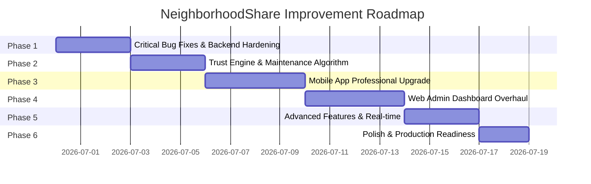

# NeighborhoodShare — Comprehensive Improvement Plan

> Transform from MVP to a **professional-grade** suburban tool lending co-op system

---

## Current State Assessment

After reading **every single file** across all three codebases, here's the honest breakdown:

### Architecture Overview

| Layer | Stack | Files | Assessment |
|-------|-------|-------|------------|
| **Server** | Express.js, MongoDB/Mongoose, JWT, WebSocket, Cloudinary | ~55 source files (16 models, 9 controllers, 12 route files, 5 services) | ⭐⭐⭐ Best structured — has escrow, priority scoring, messaging, multi-community |
| **Web Admin** | React 18 (Vite), plain CSS, Context API, **no router** | ~17 source files | ⭐⭐ Functional prototype, needs major overhaul |
| **Mobile** | React Native 0.81 + Expo SDK 54, WebSocket | ~38 source files | ⭐⭐⭐ Good feature coverage, but critical bugs |

### Key Chapter 1 Innovations — Implementation Status

| Feature | Server | Mobile | Web Admin |
|---------|--------|--------|-----------|
| Trust-Weighted Escrow Points | 🟢 Escrow lock/release + priority scoring implemented BUT **hardcoded values ignore community `trustRules` config** | 🟢 TrustWallet screen with locked/available | ❌ No management UI |
| Split-Maintenance Allocation | 🟢 Algorithm exists (last 5 borrowers, duration-weighted) | ❌ No mobile UI at all | 🟡 Basic create form + list |
| Inventory Ledger | 🟢 Full CRUD + health scores + wear logs + blocked dates | 🟢 Browse + add tools | 🟡 List + filter, no add/edit |
| Borrowing Request Engine | 🟢 11-state lifecycle with admin verification step | 🟢 Full lifecycle with pickup/return/verify | 🟡 Verification workflow only |
| Dispute Resolution | 🟢 Create + resolve + penalty deduction | 🟢 Complaint filing with evidence | 🔴 Uses `window.prompt()` |
| Secure Authentication | 🟢 JWT access (30m) + refresh (14d) + bcrypt 12 | 🔴 **Tokens NOT persisted** (in-memory only) | 🟡 JWT in localStorage, refresh stored but never used |
| Community Management | 🟢 Multi-community with memberships, join codes, posts, discovery | 🟢 Full community features + social feed | 🟢 Best page on admin |
| Messaging (Chat) | 🟢 Borrow-scoped threads + DM + WebSocket real-time | 🟢 Full chat UI with real-time | ❌ Not on admin |

---

## 🚨 Critical Bugs & Security Issues Found

> [!CAUTION]
> These issues must be fixed immediately — they break core functionality or pose security risks:

### 🔴 Security (Server)
1. **`.env` file committed to Git with LIVE credentials** — MongoDB Atlas password (`allanmonforte:allanmonforte123`), Cloudinary API keys, and weak JWT secrets (`dev_access_secret_change_me`) are all exposed. **All credentials must be rotated immediately.**
2. **No input validation** — The `validators/` directory is **completely empty**. No express-validator, Joi, or Zod. All request bodies are trusted blindly → NoSQL injection, XSS possible.
3. **Mass assignment vulnerability** — `Object.assign(tool, req.body)` in `updateTool` and `Tool.create({...req.body})` in admin tool creation allow overwriting `owner`, `community`, `healthScore`, etc.
4. **NoSQL injection via `$regex`** — Search queries in `listTools` and `discover` use unsanitized user input directly in MongoDB regex patterns.

### 🔴 Server Logic Bugs
5. **Hardcoded trust values ignore community settings** — `borrowController.js` uses hardcoded `lateDays * 5` instead of `community.trustRules.latePenaltyPerDay`, hardcoded `3` instead of `successfulBorrowReward`, hardcoded `8` instead of `lendingReward`. **Community-specific trust configurations are completely ignored.**
6. **`verifyReturn` sets wrong status for late returns** — Sets `status: "disputed"` instead of `"completed"` with lateDays, corrupting reporting.
7. **Race condition in escrow lock** — No MongoDB transaction; if server crashes between `adjustTrustPoints()` and `borrowRequest.save()`, points are locked but request isn't approved.
8. **`transferTrustPoints` uses invalid type enums** — `transfer_out`/`transfer_in` not in schema enum → MongoDB validation error.
9. **Blocked dates on tools never checked** — `blockedDates` field exists on Tool model but borrow requests don't validate against them.

### 🔴 Mobile Critical Bugs
10. **Tokens not persisted** — Auth tokens stored in plain JS variables. Users must **re-login every app restart**. No AsyncStorage, SecureStore, or MMKV used.
11. **ErrorBoundary imported but never wrapped** — Component exists but never used in `App.js`.
12. **Undefined style references** — `styles.primaryButtonDisabled` and `styles.linkRow` are referenced but never defined → potential runtime crashes.
13. **NotificationsScreen is a 27-line stub** — No SafeAreaView, no ScrollView, no mark-as-read, no pull-to-refresh.
14. **Theme color naming wrong** — `colors.green` is `#132f4c` (navy blue), not green.
15. **Vote buttons and Discuss button on community posts are non-functional** — UI exists but no handlers.
16. **`ActivityHistoryScreen` borrower check is logically wrong** — `item.borrower === item.owner` compares two different IDs.

### 🔴 Web Admin Critical Bugs
17. **No real routing** — Uses `useState("dashboard")` to switch pages. No URL navigation, no browser back/forward.
18. **`window.prompt()` in DisputesPage** — Uses browser prompt for penalty and resolution. Extremely poor UX.
19. **Hardcoded dev credentials** in LoginPage source code.
20. **Refresh token stored but never used** for renewal → sessions expire silently.

---

## User Review Required

> [!IMPORTANT]
> **This plan is organized in 6 phases.** Each phase builds on the previous one and produces a working, improved version. Please confirm which phases to tackle, or if you want all of them.

> [!WARNING]
> **Breaking Changes in Phase 1**: Database model changes (new fields, indexes) require migration if you have production data. New packages need to be installed.

## Open Questions

> [!IMPORTANT]
> 1. **Do you have existing data in MongoDB Atlas?** The `.env` has a live connection string. If yes, we need migration scripts before changing schemas.
> 2. **Do you want real email notifications?** Currently `verifyEmail` just sets a flag — no actual email is sent. Options: Nodemailer + Gmail, SendGrid, Resend.
> 3. **Should we rotate your MongoDB Atlas and Cloudinary credentials?** They're committed to Git and exposed.
> 4. **What's your deployment target?** (Railway, Render, DigitalOcean, etc.) This affects production config.
> 5. **Do you want a logout endpoint?** Currently there's no way to invalidate refresh tokens server-side.

---

## Proposed Changes

### Phase Overview



---

## Phase 1: Critical Bug Fixes & Backend Hardening

**Goal**: Fix all critical/breaking bugs, harden the server, and establish a solid foundation.

---

### 🔧 Critical Mobile Fixes

#### [MODIFY] [client.js](file:///c:/Users/allan/Desktop/AppDev-Project/Mobile/src/api/client.js)
- **Add token persistence** using `expo-secure-store` instead of in-memory variables
- Users will no longer need to re-login on every app restart
- Add automatic token refresh on 401 responses
- Add retry logic for transient failures

#### [MODIFY] [App.js](file:///c:/Users/allan/Desktop/AppDev-Project/Mobile/App.js)
- **Wrap app in ErrorBoundary** (it's imported but never used!)
- Add proper error recovery UI

#### [MODIFY] [styles.js](file:///c:/Users/allan/Desktop/AppDev-Project/Mobile/src/styles/styles.js)
- **Add missing style definitions**: `primaryButtonDisabled`, `linkRow`
- Fix theme color naming: rename misleading `green` → `navy`, add actual `green` color
- Add loading/skeleton styles
- Add consistent shadow elevations

#### [MODIFY] [theme.js](file:///c:/Users/allan/Desktop/AppDev-Project/Mobile/src/styles/theme.js)
- Fix `colors.green` (`#132f4c` → rename to `colors.navy`)
- Add proper `colors.green` (`#059669`)
- Add semantic color aliases (success, warning, error, info)
- Add dark mode palette
- Add typography scale

#### [MODIFY] [NotificationsScreen.js](file:///c:/Users/allan/Desktop/AppDev-Project/Mobile/src/screens/NotificationsScreen.js)
- Complete rewrite from 27-line stub to full notification screen
- Add SafeAreaView and ScrollView
- Add pull-to-refresh
- Add mark-as-read/mark-all-as-read
- Add notification grouping by date (Today, Yesterday, This Week)
- Add different icons per notification type
- Add tap-to-navigate to related screen
- Add empty state illustration

---

### 🔧 Critical Web Admin Fixes

#### [MODIFY] [App.jsx](file:///c:/Users/allan/Desktop/AppDev-Project/Web/src/routes/App.jsx)
- **Replace `useState` page switching with `react-router-dom`**
- Add proper URL-based routing with browser history
- Add lazy loading for route components (code splitting)
- Add error boundaries
- Add breadcrumbs

#### [MODIFY] [LoginPage.jsx](file:///c:/Users/allan/Desktop/AppDev-Project/Web/src/pages/LoginPage.jsx)
- **Remove hardcoded dev credentials** from source code
- Add loading state on login button
- Replace Unsplash background image with local asset or CSS gradient
- Add "forgot password" placeholder

#### [MODIFY] [DisputesPage.jsx](file:///c:/Users/allan/Desktop/AppDev-Project/Web/src/pages/DisputesPage.jsx)
- **Replace `window.prompt()` with proper modal dialogs**
- Add dispute detail view with evidence display
- Add resolution form with categories, notes, penalty input
- Add dispute status workflow visualization
- Add related borrowing and user links

#### [MODIFY] [client.js](file:///c:/Users/allan/Desktop/AppDev-Project/Web/src/api/client.js)
- Add automatic token refresh using stored refresh token
- Add request abort controllers for component unmounts
- Add proper error response parsing

#### [MODIFY] [authStore.jsx](file:///c:/Users/allan/Desktop/AppDev-Project/Web/src/store/authStore.jsx)
- Add token refresh logic
- Add session timeout handling
- Add proper error states

---

### 🔧 Server Backend — Security & Bug Fixes

#### [FIX] `.env` Security
- Remove `.env` from Git tracking
- Add `.env` to `.gitignore` (verify it's there)
- User must rotate MongoDB Atlas password, Cloudinary keys, and JWT secrets
- Update `.env.example` with strong secret placeholders

#### [NEW] Input Validation — Populate empty `validators/` directory
- [NEW] [authValidator.js](file:///c:/Users/allan/Desktop/AppDev-Project/Server/src/validators/authValidator.js) — Validate register/login bodies
- [NEW] [toolValidator.js](file:///c:/Users/allan/Desktop/AppDev-Project/Server/src/validators/toolValidator.js) — Validate tool create/update
- [NEW] [borrowValidator.js](file:///c:/Users/allan/Desktop/AppDev-Project/Server/src/validators/borrowValidator.js) — Validate borrow request bodies
- [NEW] [adminValidator.js](file:///c:/Users/allan/Desktop/AppDev-Project/Server/src/validators/adminValidator.js) — Validate admin actions
- Use `express-validator` or `zod` for schema validation
- Sanitize all `$regex` search inputs to prevent NoSQL injection

#### [MODIFY] [borrowController.js](file:///c:/Users/allan/Desktop/AppDev-Project/Server/src/controllers/borrowController.js)
- **Fix hardcoded trust values** — Replace `lateDays * 5` with `community.trustRules.latePenaltyPerDay * lateDays`
- **Fix hardcoded rewards** — Use `community.trustRules.successfulBorrowReward` and `lendingReward`
- **Fix `verifyReturn` late status** — Change `status: "disputed"` to `status: "completed"` with `lateDays > 0`
- **Add MongoDB transactions** for escrow lock/release operations (atomic multi-step)
- **Add blocked dates validation** — Check `tool.blockedDates` before allowing borrow requests
- **Add date overlap checking** — Prevent double-booking same tool on overlapping dates

#### [MODIFY] [toolController.js](file:///c:/Users/allan/Desktop/AppDev-Project/Server/src/controllers/toolController.js)
- **Fix mass assignment** — Whitelist allowed fields in `updateTool` instead of `Object.assign(tool, req.body)`
- Add ownership + community validation for admin tool deletion

#### [MODIFY] [adminController.js](file:///c:/Users/allan/Desktop/AppDev-Project/Server/src/controllers/adminController.js)
- **Fix mass assignment** in `createToolAsAdmin` — Whitelist allowed fields
- Add server-side search, filtering, and pagination to all list endpoints
- Add advanced statistics endpoint (trends over time)

#### [MODIFY] [communityController.js](file:///c:/Users/allan/Desktop/AppDev-Project/Server/src/controllers/communityController.js)
- **Fix mass assignment** in `updateMine` — Whitelist fields, prevent overwriting `joinCode`, `createdBy`
- Sanitize `$regex` in `discover` search

#### [MODIFY] [trustService.js](file:///c:/Users/allan/Desktop/AppDev-Project/Server/src/services/trustService.js)
- **Fix `transferTrustPoints`** — Either add `transfer_out`/`transfer_in` to TrustPointTransaction enum, or remove dead code
- **Fix `username` reference** — User model has no `username` field

#### [MODIFY] [userRoutes.js](file:///c:/Users/allan/Desktop/AppDev-Project/Server/src/routes/userRoutes.js)
- **Fix follow/unfollow ObjectId comparison** — Use `.some(id => id.toString() === ...)` instead of `.includes()`
- Move inline route handlers to a proper `userController.js`

#### [MODIFY] [auth.js](file:///c:/Users/allan/Desktop/AppDev-Project/Server/src/middleware/auth.js) (middleware)
- Add stricter rate limiting on auth routes (10 req/15 min)

#### [NEW] [logoutRoute](file:///c:/Users/allan/Desktop/AppDev-Project/Server/src/routes/authRoutes.js)
- Add `POST /api/auth/logout` to invalidate refresh token (set `user.refreshTokenHash = null`)

#### [NEW] [notificationController.js](file:///c:/Users/allan/Desktop/AppDev-Project/Server/src/controllers) updates
- Add `PUT /notifications/:id/read` — Mark single notification as read
- Add `PUT /notifications/read-all` — Mark all as read
- Add pagination to notifications list

#### [NEW] [ratingController.js](file:///c:/Users/allan/Desktop/AppDev-Project/Server/src/controllers/ratingController.js) + [ratingRoutes.js](file:///c:/Users/allan/Desktop/AppDev-Project/Server/src/routes/ratingRoutes.js)
- Submit rating after borrowing completion
- Get ratings for a user / tool
- Calculate and update average ratings
- New `Rating` model (or add to existing Borrowing)

#### [NEW] Pagination middleware
- Reusable middleware supporting `page`, `limit`, `sort` query params
- Apply to: notifications, borrow requests, tools, users, disputes, messages

---

## Phase 2: Trust Engine Enhancement & Maintenance Polish

**Goal**: The server already has `trustService.js` with escrow lock/release and `maintenanceService.js` with weighted allocation. This phase **enhances** them to use community config, adds tier logic, and surfaces them properly on all clients.

---

### Trust-Weighted Escrow Points — Enhancement

The existing `trustService.adjustTrustPoints()` already handles escrow_lock, escrow_release, rewards, penalties. The key fix is **using community trustRules** instead of hardcoded values (done in Phase 1), plus these enhancements:

#### [MODIFY] [trustService.js](file:///c:/Users/allan/Desktop/AppDev-Project/Server/src/services/trustService.js)
- Add `getTrustTier(score)` function: 0-25 Bronze, 26-50 Silver, 51-75 Gold, 76-100 Platinum
- Add tier to all trust point API responses
- Fix `transferTrustPoints` dead code (enum bug + missing username field)
- Add `getLifetimeStats(userId)` — total earned, total deducted, tier history
- Add monthly good standing bonus logic (+2 for users with score > 50 who had no penalties)
- Add review reward (+1 for leaving a rating)

#### [MODIFY] [User.js](file:///c:/Users/allan/Desktop/AppDev-Project/Server/src/models/User.js)
- Add `trustTier` virtual computed from `trustPoints`
- Populate `trustTier` on user profile responses
- Add index on `trustPoints` for tier distribution queries

#### Enhanced Trust Rules (already stored in `Community.trustRules`):

| Rule | DB Field (already exists) | Current Usage |
|------|---------------------------|---------------|
| Starting points | `startingPoints` (100) | ✅ Used in registration |
| Max concurrent borrows | `maxConcurrentBorrows` (3) | ✅ Used in borrow controller |
| Escrow points | `escrowPoints` (10) | ⚠️ Tools use own `depositPoints` — reconcile |
| Late penalty per day | `latePenaltyPerDay` (5) | ❌ Hardcoded — **fix in Phase 1** |
| Damage penalty | `damagePenalty` (15) | ❌ Hardcoded — **fix in Phase 1** |
| Lending reward | `lendingReward` (3) | ❌ Hardcoded as 8 — **fix in Phase 1** |
| Successful borrow reward | `successfulBorrowReward` (5) | ❌ Hardcoded as 3 — **fix in Phase 1** |

**New Tier-Based Features**:
- Platinum (76-100): Auto-approval for tools with `depositPoints ≤ 10`
- Gold (51-75): Normal flow
- Silver (26-50): Warning displayed on profile
- Bronze (0-25): All borrows require admin verification (already partially implemented via `admin_review` status)

#### [MODIFY] Admin trust routes (already has `/api/trust-points/adjust`)
- Add `GET /api/admin/trust-distribution` — Tier distribution stats for dashboard chart
- Add `GET /api/admin/trust-leaderboard` — Top/bottom trust users

---

### Split-Maintenance Allocation — Enhancement

The existing `maintenanceService.js` already has a working algorithm that:
- Finds last 5 completed borrows for a tool
- Weights by `borrowDurationDays + (lateDays > 0 ? 2 : 0)` (late borrowers pay more)
- Allocates `estimatedPointCost` proportionally
- Deducts points from each borrower
- Sets tool to `maintenance` status and drops `healthScore` by 15

#### Enhancements needed:

#### [MODIFY] [maintenanceService.js](file:///c:/Users/allan/Desktop/AppDev-Project/Server/src/services/maintenanceService.js)
- Add configurable lookback period (currently hardcoded to last 5 borrows)
- Add multiple allocation methods: `equal`, `usage-weighted` (current), `duration-weighted`
- Add notification to affected users about their share
- Add evidence image support

#### [MODIFY] [maintenanceController.js](file:///c:/Users/allan/Desktop/AppDev-Project/Server/src/controllers/maintenanceController.js)
- Add `GET /api/maintenance/my-charges` — User's pending maintenance allocations
- Add `PATCH /api/maintenance/:id/accept` — User accepts their share
- Add `PATCH /api/maintenance/:id/dispute` — User disputes their share
- Add maintenance history per tool endpoint

---

## Phase 3: Mobile App Professional Upgrade

**Goal**: Elevate the mobile app from MVP to polished, professional quality.

---

### New Screens

#### [NEW] [RatingScreen.js](file:///c:/Users/allan/Desktop/AppDev-Project/Mobile/src/screens/RatingScreen.js)
- Star rating component (1-5) with animated fill
- Review text input
- Rate both as borrower → lender and lender → borrower
- Shown after borrowing completion

#### [NEW] [MaintenanceCostScreen.js](file:///c:/Users/allan/Desktop/AppDev-Project/Mobile/src/screens/MaintenanceCostScreen.js)
- View maintenance cost allocations assigned to user
- Accept or dispute individual charges
- Payment/contribution history
- Report maintenance need for tools user has borrowed

#### [NEW] [ToolCalendarScreen.js](file:///c:/Users/allan/Desktop/AppDev-Project/Mobile/src/screens/ToolCalendarScreen.js)
- Calendar view showing tool availability
- Colored date blocks: available (green), reserved (yellow), borrowed (red)
- Select dates from calendar to create borrow request
- Block already-reserved dates

#### [NEW] [AdvancedSearchScreen.js](file:///c:/Users/allan/Desktop/AppDev-Project/Mobile/src/screens/AdvancedSearchScreen.js)
- Advanced filter sheet with:
  - Category multi-select
  - Condition filter
  - Availability window filter
  - Trust score range of owner
  - Sort by: newest, most popular, highest rated
- Save filter presets

---

### Improved Existing Screens

#### [MODIFY] [HomeScreen.js](file:///c:/Users/allan/Desktop/AppDev-Project/Mobile/src/screens/HomeScreen.js)
- Add pull-to-refresh (currently missing)
- Add skeleton loading placeholders instead of spinner
- Add featured/trending tools section
- Add overdue borrowing warnings prominently
- Better loading state on initial load

#### [MODIFY] [BrowseToolsScreen.js](file:///c:/Users/allan/Desktop/AppDev-Project/Mobile/src/screens/BrowseToolsScreen.js)
- Add debounced search (currently fires on every keystroke)
- Add pagination / infinite scroll
- Fix FAB button overlapping content
- Add pull-to-refresh

#### [MODIFY] [ProfileScreen.js](file:///c:/Users/allan/Desktop/AppDev-Project/Mobile/src/screens/ProfileScreen.js)
- Add animated trust tier badge (Bronze/Silver/Gold/Platinum)
- Add statistics cards with animations (tools listed, borrows completed, reviews)
- Better visual hierarchy and card layout
- Link to ratings/reviews

#### [MODIFY] [ToolDetailScreen.js](file:///c:/Users/allan/Desktop/AppDev-Project/Mobile/src/screens/ToolDetailScreen.js)
- Add owner trust badge display
- Add tool rating/reviews section
- Add availability calendar preview
- Add "Similar Tools" section
- Fix double padding issue (`contentInner`)
- Remove dead code (`const _ = null`)

#### [MODIFY] [BorrowingsScreen.js](file:///c:/Users/allan/Desktop/AppDev-Project/Mobile/src/screens/BorrowingsScreen.js)
- Add pull-to-refresh
- Add overdue warnings with visual urgency
- Add "Rate" action button after completion
- Add link to maintenance costs if applicable

#### [MODIFY] [CommunityScreen.js](file:///c:/Users/allan/Desktop/AppDev-Project/Mobile/src/screens/CommunityScreen.js)
- **Refactor from 448-line god-component** into sub-components:
  - `CommunityFeed.js`
  - `PostComposer.js`
  - `CommunityDiscovery.js`
  - `JoinCommunityModal.js`
- Fix non-functional vote buttons (add handlers)
- Fix non-functional "Discuss" button
- Add proper error handling

#### [MODIFY] [AddToolScreen.js](file:///c:/Users/allan/Desktop/AppDev-Project/Mobile/src/screens/AddToolScreen.js)
- Add input validation (currently can submit empty fields)
- Add form field error messages
- Add loading/disabled state on submit button to prevent double submissions

---

### New Components

#### [NEW] [SkeletonLoader.js](file:///c:/Users/allan/Desktop/AppDev-Project/Mobile/src/components/SkeletonLoader.js)
- Shimmer animation skeleton for loading states
- Configurable shapes: card, list item, profile header, stat card

#### [NEW] [EmptyState.js](file:///c:/Users/allan/Desktop/AppDev-Project/Mobile/src/components/EmptyState.js)
- Friendly illustration with message and action button
- Reusable across all list screens

#### [NEW] [StarRating.js](file:///c:/Users/allan/Desktop/AppDev-Project/Mobile/src/components/StarRating.js)
- Interactive star rating (1-5)
- Animated fill on tap
- Read-only display mode

#### [NEW] [TrustBadge.js](file:///c:/Users/allan/Desktop/AppDev-Project/Mobile/src/components/TrustBadge.js)
- Visual trust tier badge (Bronze/Silver/Gold/Platinum)
- Animated ring with tier color
- Mini and full variants

#### [NEW] [CalendarPicker.js](file:///c:/Users/allan/Desktop/AppDev-Project/Mobile/src/components/CalendarPicker.js)
- Calendar component showing available/unavailable dates
- Date range selection for borrowing
- Integrates with tool availability data

#### [NEW] [AnimatedButton.js](file:///c:/Users/allan/Desktop/AppDev-Project/Mobile/src/components/AnimatedButton.js)
- Scale animation on press
- Loading spinner state
- Haptic feedback integration
- Replace basic TouchableOpacity in key actions

#### [NEW] [Toast.js](file:///c:/Users/allan/Desktop/AppDev-Project/Mobile/src/components/Toast.js)
- Slide-in toast for success/error feedback
- Auto-dismiss with progress indicator
- Success (green), Error (red), Warning (yellow), Info (blue) variants

#### [MODIFY] [ToolCard.js](file:///c:/Users/allan/Desktop/AppDev-Project/Mobile/src/components/ToolCard.js)
- Add trust badge on owner
- Add rating stars display
- Add availability indicator
- Better shadow and card design
- Add subtle press animation

#### [MODIFY] [AppNavigator.js / RootStack.js](file:///c:/Users/allan/Desktop/AppDev-Project/Mobile/src/navigation/RootStack.js)
- Add new screens to navigation (Rating, MaintenanceCost, ToolCalendar, AdvancedSearch)
- Add deep linking configuration for notifications
- Improve tab bar styling

---

## Phase 4: Web Admin Dashboard Overhaul

**Goal**: Transform from a basic prototype into a professional, data-rich admin panel.

---

### Architecture Fix — Add Real Routing

#### Install `react-router-dom`

#### [MODIFY] [App.jsx](file:///c:/Users/allan/Desktop/AppDev-Project/Web/src/routes/App.jsx) → complete rewrite
- Replace `useState("dashboard")` with `react-router-dom` routes
- Add `BrowserRouter` with proper URL paths
- Add lazy loading for all page components
- Add error boundary wrapper
- Add breadcrumb support

#### [NEW] [Layout.jsx](file:///c:/Users/allan/Desktop/AppDev-Project/Web/src/layouts/Layout.jsx)
- Move sidebar + topbar into a proper layout component (currently empty `layouts/` dir)
- Add responsive sidebar (collapsible on smaller screens)
- Add breadcrumb bar
- Add dark mode toggle
- Add notification bell with badge count

---

### Dashboard Redesign

#### [MODIFY] [DashboardPage.jsx](file:///c:/Users/allan/Desktop/AppDev-Project/Web/src/pages/DashboardPage.jsx)
Currently: 6 stat cards + announcement form. Transform to:
- **Animated stat cards** with trend indicators (↑ +12% vs last month) and gradient backgrounds
- **Borrowing Trends Chart** — Line chart: daily/weekly/monthly borrowing activity
- **Tool Utilization Chart** — Bar chart: top 10 most/least borrowed tools
- **Category Distribution** — Donut chart: tools by category breakdown
- **Trust Score Distribution** — Histogram of user trust tiers
- **Recent Activity Feed** — Live-updating timeline of system events
- **Overdue Alert Panel** — Highlighted overdue items requiring attention
- **Quick Actions** — Shortcuts to common admin tasks

---

### New Admin Pages

#### [NEW] [TrustManagementPage.jsx](file:///c:/Users/allan/Desktop/AppDev-Project/Web/src/pages/TrustManagementPage.jsx)
- User trust score table with search and tier filter (Bronze/Silver/Gold/Platinum)
- Manual trust point adjustment modal with reason field
- Trust history timeline viewer per user
- Trust system configuration (edit point values, tier thresholds)
- Tier distribution visualization chart
- Escrow balance monitoring

#### [NEW] [MaintenanceDashboardPage.jsx](file:///c:/Users/allan/Desktop/AppDev-Project/Web/src/pages/MaintenanceDashboardPage.jsx)
- Pending maintenance cost requests
- Cost allocation breakdown view
- Approve/reject/override allocations
- Allocation method configuration
- Per-tool maintenance history timeline
- Total maintenance cost analytics

#### [NEW] [ActivityLogPage.jsx](file:///c:/Users/allan/Desktop/AppDev-Project/Web/src/pages/ActivityLogPage.jsx)
- Searchable, filterable audit log of all admin actions
- Date range picker for filtering
- Action type filtering
- Export capability (CSV)

#### [NEW] [NotificationsPage.jsx](file:///c:/Users/allan/Desktop/AppDev-Project/Web/src/pages/NotificationsPage.jsx)
- Send targeted notifications to users/groups
- Broadcast announcements (upgrade existing form)
- Notification history and delivery stats
- Template management

---

### Improved Existing Pages

#### [MODIFY] [ReportsPage.jsx](file:///c:/Users/allan/Desktop/AppDev-Project/Web/src/pages/ReportsPage.jsx)
Currently: PDF download buttons + 4 list blocks. Transform to:
- Report generator with **date range picker** and filters
- Pre-built templates: Borrowing Summary, Tool Utilization, User Activity, Trust Scores, Maintenance Costs, Overdue Items
- **Charts and visualizations** for each report
- Export to CSV and PDF
- Scheduled report generation

#### [MODIFY] [UsersPage.jsx](file:///c:/Users/allan/Desktop/AppDev-Project/Web/src/pages/UsersPage.jsx)
- Add **server-side search** and pagination
- Add user detail slide-out panel with full profile, trust history, borrowing history
- Add trust tier badge display
- Add bulk actions (verify multiple, suspend multiple)
- Add confirmation dialogs for destructive actions

#### [MODIFY] [InventoryPage.jsx](file:///c:/Users/allan/Desktop/AppDev-Project/Web/src/pages/InventoryPage.jsx)
- Add **search** functionality
- Add **add/edit tool modal** (currently can only disable/delete)
- Add tool detail view with borrowing history, maintenance history, ratings
- Add pagination
- Add health score visualization

#### [MODIFY] [BorrowingPage.jsx](file:///c:/Users/allan/Desktop/AppDev-Project/Web/src/pages/BorrowingPage.jsx)
- Add overdue highlighting with urgency colors
- Add date range filtering
- Add pagination
- Add trust scores of involved parties
- Add borrowing history view

#### [MODIFY] [SettingsPage.jsx](file:///c:/Users/allan/Desktop/AppDev-Project/Web/src/pages/SettingsPage.jsx)
Currently: Read-only display. Transform to:
- **Editable** trust rules (point values, tier thresholds)
- Borrowing duration limits configuration
- Maintenance allocation default settings
- Community settings editor
- Admin profile management
- Password change form

---

### New Reusable Components

#### [NEW] [Chart.jsx](file:///c:/Users/allan/Desktop/AppDev-Project/Web/src/components/Chart.jsx)
- Wrapper for `recharts` library
- Line, Bar, Area, Pie/Donut chart types
- Responsive and consistent styling

#### [NEW] [DateRangePicker.jsx](file:///c:/Users/allan/Desktop/AppDev-Project/Web/src/components/DateRangePicker.jsx)
- Calendar-based date range picker
- Presets: Today, Last 7 Days, Last 30 Days, This Month, Custom

#### [NEW] [Toast.jsx](file:///c:/Users/allan/Desktop/AppDev-Project/Web/src/components/Toast.jsx)
- Toast notification system for action feedback
- Success, Error, Warning, Info variants
- Auto-dismiss + close button

#### [NEW] [Pagination.jsx](file:///c:/Users/allan/Desktop/AppDev-Project/Web/src/components/Pagination.jsx)
- Page navigation with items-per-page selector
- Total count display

#### [NEW] [ConfirmDialog.jsx](file:///c:/Users/allan/Desktop/AppDev-Project/Web/src/components/ConfirmDialog.jsx)
- Confirmation modal for destructive actions
- Replace all direct `window.confirm()` / `window.prompt()` calls

#### [NEW] [TrustTierBadge.jsx](file:///c:/Users/allan/Desktop/AppDev-Project/Web/src/components/TrustTierBadge.jsx)
- Visual trust tier indicator with color and icon
- Bronze (copper), Silver, Gold, Platinum colors

#### [NEW] [ExportButton.jsx](file:///c:/Users/allan/Desktop/AppDev-Project/Web/src/components/ExportButton.jsx)
- Export data as CSV or trigger PDF download
- Loading state during generation

#### [NEW] [EmptyState.jsx](file:///c:/Users/allan/Desktop/AppDev-Project/Web/src/components/EmptyState.jsx)
- Friendly empty state for tables and lists

#### [NEW] [ErrorBoundary.jsx](file:///c:/Users/allan/Desktop/AppDev-Project/Web/src/components/ErrorBoundary.jsx)
- React error boundary with fallback UI
- "Something went wrong" with retry option

---

### Styling Overhaul

#### [MODIFY] [global.css](file:///c:/Users/allan/Desktop/AppDev-Project/Web/src/styles/global.css)
Currently 305 lines, single file for everything. Transform:
- Split into modular CSS files (base, layout, components, pages, utilities)
- Add **Google Fonts** (Inter or Outfit) for modern typography
- Add **dark mode** support with `[data-theme="dark"]`
- Add **CSS transitions** and micro-animations
- Add **glassmorphism** effects on key panels
- Replace Unsplash background on login with CSS gradient or local image
- Add responsive breakpoints (mobile, tablet, desktop)
- Add smooth scrollbar styling
- Add skeleton loading animation classes
- Add premium button styles with hover/active states
- Add card hover effects (shadow lift)
- Add animated stat counters

---

## Phase 5: Advanced Features

**Goal**: Add differentiating features that make NeighborhoodShare truly stand out.

---

### Enhanced Real-time (Server + All Clients)

#### [NEW] [socketServer.js](file:///c:/Users/allan/Desktop/AppDev-Project/Server/src/config/socketServer.js)
- Enhance existing WebSocket with Socket.io for reliability
- Room-based architecture (per-user, per-community)
- Events: borrowing status changes, new requests, dispute updates, maintenance alerts, trust point changes

#### Web Admin: Add Socket.io client
- Live dashboard updates (real-time stat cards)
- Notification bell with live badge count
- Activity feed auto-refresh

#### Mobile: Enhance WebSocket
- Add automatic reconnection logic (currently drops silently)
- Add connection status indicator
- Add offline queue for failed messages

---

### Scheduled Jobs (Server)

#### [NEW] [cronJobs.js](file:///c:/Users/allan/Desktop/AppDev-Project/Server/src/services/cronJobs.js)
Automated background tasks using `node-cron`:
- **Overdue detection** (daily): Check for overdue borrowings, send reminders, auto-deduct trust points
- **Return reminders** (daily): Notify borrowers 1 day before due date
- **Monthly trust bonus**: Award +2 points to users with good standing
- **Stale listing cleanup**: Flag tools not updated in 6+ months
- **Analytics aggregation**: Pre-compute dashboard stats for fast loading

---

### Push Notifications (Mobile)

#### [MODIFY] [AuthProvider.js](file:///c:/Users/allan/Desktop/AppDev-Project/Mobile/src/store/AuthProvider.js)
- Enhance Expo Push Notifications setup (currently skipped in Expo Go)
- Add foreground notification handler with custom display
- Add background notification handler
- Add notification tap navigation (deep link to related screen)

---

### Password Recovery

#### [NEW] Server: `/auth/forgot-password` and `/auth/reset-password` endpoints
#### [NEW] Mobile: Forgot password screen
#### [NEW] Web: Forgot password link on login page

---

## Phase 6: Polish & Production Readiness

**Goal**: Final polish, testing infrastructure, and production configuration.

---

### Server

#### [NEW] [seed.js](file:///c:/Users/allan/Desktop/AppDev-Project/Server/src/utils/seed.js)
- Demo data seeder: 20 users, 50 tools, 100 borrowings, disputes, trust scores
- `npm run seed` command

#### [MODIFY] [package.json](file:///c:/Users/allan/Desktop/AppDev-Project/Server/package.json)
- Add new dependencies: `express-rate-limit`, `helmet`, `socket.io`, `node-cron`
- Add scripts: `seed`, `dev`, `start`

#### Add MongoDB indexes to all models on frequently queried fields

---

### Mobile

- Custom splash screen with NeighborhoodShare branding
- Haptic feedback on important actions (approve, reject, submit)
- Image caching with `expo-image` for tool photos
- Pull-to-refresh on ALL list screens
- Consistent loading states across all screens
- Error retry UI on network failures
- Input sanitization on all forms

---

### Web Admin

- Lazy loading all page routes (code splitting)
- Error boundaries on every page
- Keyboard shortcuts for power admin users
- Responsive sidebar (collapsible)
- Dark mode toggle with persistence
- Loading skeletons instead of spinners

---

## New Dependencies Summary

### Server
| Package | Purpose |
|---------|---------|
| `express-rate-limit` | API rate limiting |
| `helmet` | Security headers |
| `socket.io` | Reliable real-time communication |
| `node-cron` | Scheduled background jobs |

### Web Admin
| Package | Purpose |
|---------|---------|
| `react-router-dom` | Proper URL routing |
| `recharts` | Charts and data visualization |
| `react-hot-toast` | Toast notifications |

### Mobile
| Package | Purpose |
|---------|---------|
| `expo-secure-store` | Secure token storage (replacing in-memory) |
| `expo-haptics` | Haptic feedback |
| `expo-image` | Cached image loading |

---

## Verification Plan

### Automated Tests

```bash
# Server — build/lint check
cd Server && npm start

# Web — production build (catches import/syntax errors)
cd Web && npm run build

# Mobile — Expo export (catches build errors)
cd Mobile && npx expo export
```

### Manual Verification Checklist

**Server**:
- [ ] Auth flow: register → login → refresh token → access protected routes
- [ ] Full borrowing lifecycle: request → approve → pickup → return → rate
- [ ] Trust points: verify correct points after each action type
- [ ] Escrow: verify points held during active borrowing, released on return
- [ ] Maintenance allocation: verify algorithm distributes costs correctly
- [ ] Dispute: user files → admin reviews → resolves → notifications sent
- [ ] Pagination working on all list endpoints
- [ ] Rate limiting blocks excessive requests

**Web Admin**:
- [ ] URL routing works (can bookmark pages, browser back/forward)
- [ ] Dashboard shows charts with real data
- [ ] All CRUD operations show toast feedback
- [ ] Trust management page shows tiers, allows adjustments
- [ ] Reports generate with date range filters
- [ ] Disputes use proper modals (no `window.prompt`)
- [ ] Dark mode toggle works and persists
- [ ] Pages are responsive on different screen sizes
- [ ] No hardcoded credentials in source

**Mobile**:
- [ ] **Tokens persist across app restarts** (critical fix verified)
- [ ] Full borrowing lifecycle works end-to-end
- [ ] Trust wallet shows correct available/locked points
- [ ] Rating screen appears after borrowing completion
- [ ] Notifications screen fully functional (mark read, tap navigate)
- [ ] Maintenance cost screen shows allocations
- [ ] Calendar shows tool availability
- [ ] All screens have skeleton loading and empty states
- [ ] Community vote/discuss buttons are functional
- [ ] No runtime crashes from undefined styles

---

> [!TIP]
> This plan is designed to be executed **phase by phase**. Each phase produces a working, improved version. **Phase 1 is the most critical** as it fixes breaking bugs. Let me know which phase(s) you'd like to start with and I'll begin implementation immediately.
